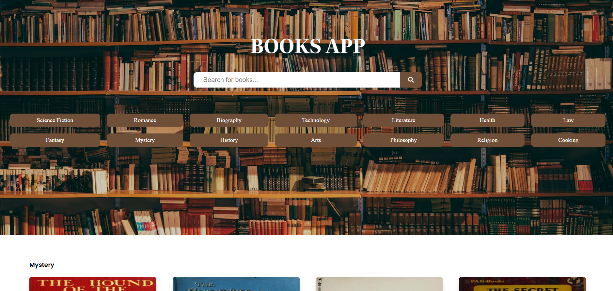
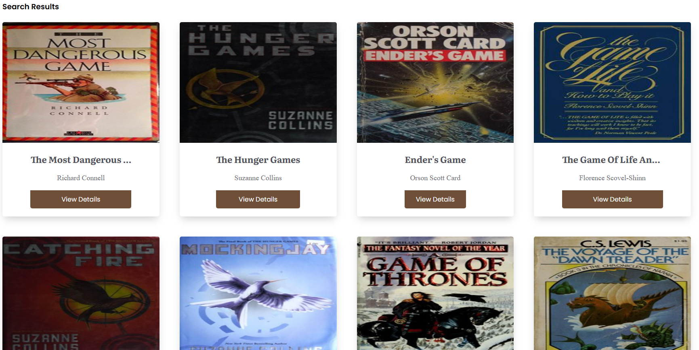
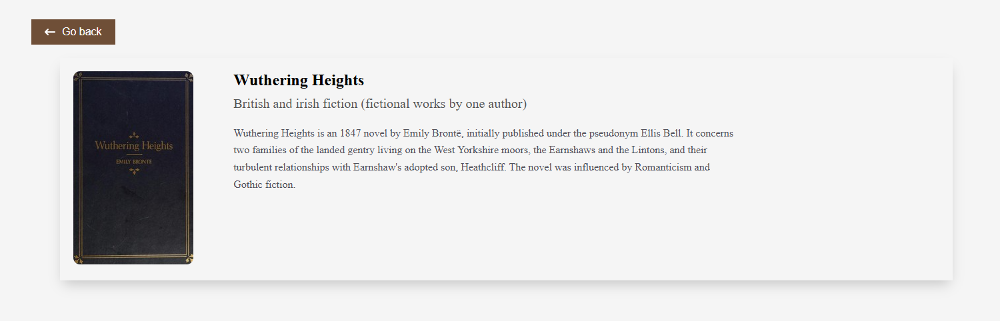

# 📚 Book App

A simple yet functional book browsing website built with **React**, **Redux Toolkit**, **TypeScript**, and other modern technologies.  
This project was created as a **learning exercise** to practice working with state management, API integration, routing, and component-based architecture in a real-world scenario.

Users can search for books, filter them by category, and view detailed information using data from the [OpenLibrary API](https://openlibrary.org/developers/api).



---

## 🧑‍💻 About This Project

This is a personal learning project designed to:

- Practice modern **React development** with TypeScript
- Learn how to manage complex state using **Redux Toolkit**
- Implement real-world **API integration** with Axios
- Work with **React Router** for dynamic navigation
- Gain experience building clean and structured UI

It’s not a production-ready application, but a great way to experiment and apply key frontend concepts.

---


## 🚀 Features

- 🔍 **Search for books** by title or keyword
- 📂 **Filter books** by categories
- 📚 **View detailed information** about each book
- ⏳ **Loading state** handling for smooth UX
- ⚡ **Fast and optimized** with [Vite](https://vitejs.dev/)
- 🎨 Beautiful icons with [react-icons](https://react-icons.github.io/react-icons/)

---

## 🛠️ Tech Stack

| Technology        | Description                                 |
|------------------|---------------------------------------------|
| **React**         | UI library for building user interfaces     |
| **Redux Toolkit** | State management made easy and scalable     |
| **React Redux**   | Official bindings for React and Redux       |
| **TypeScript**    | Typed JavaScript for safer development      |
| **React Router**  | Declarative routing for React               |
| **Axios**         | HTTP client for API requests                |
| **Vite**          | Lightning-fast frontend tooling             |
| **React Icons**   | Popular icons for React applications        |

---

## 🌐 API

This app uses the [Open Library API](https://openlibrary.org/developers/api) to fetch book data, including:

- Book title
- Author
- Cover image
- Description
- Subject categories

---

## 📸 Screenshots
Search Page

Description page


---

## 🧪 How to Use

1. Clone the repository:
   ```bash
   git clone https://github.com/thrillu4/book-app.git
2. Run:
   ```bash
   npm install
  3. Run: 
  ```bash
  npm run dev
